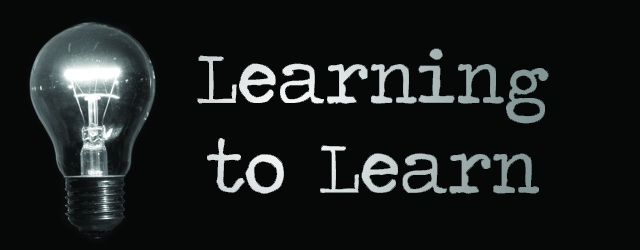

# awesome-meta-learning 

A curated list of Meta-Learning resources. Inspired by [awesome-deep-vision](https://github.com/kjw0612/awesome-deep-vision), [awesome-adversarial-machine-learning](https://github.com/yenchenlin/awesome-adversarial-machine-learning), [awesome-deep-learning-papers](https://github.com/terryum/awesome-deep-learning-papers), and [awesome-architecture-search](https://github.com/markdtw/awesome-architecture-search).

Please feel free to [pull requests](https://github.com/dragen1860/awesome-meta-learning/pulls) or [open an issue](https://github.com/dragen1860/awesome-meta-learning/issues) to add papers.
 

# Papers and Code
* [Learning to Learn with Gradients](https://www2.eecs.berkeley.edu/Pubs/TechRpts/2018/EECS-2018-105.html). Finn, Chelsea. 
* [How to train your MAML](https://arxiv.org/abs/1810.09502). Antreas Antoniou, Harrison Edwards, Amos Storkey.

* [Learned optimizers that outperform SGD on wall-clock and validation loss](https://arxiv.org/abs/1810.10180). Luke Metz, Niru Maheswaranathan, Jeremy Nixon, C. Daniel Freeman, Jascha Sohl-Dickstein
* [Gradient Agreement as an Optimization Objective for Meta-Learning](https://arxiv.org/pdf/1810.08178.pdf). Amir Erfan Eshratifar, David Eigen, Massoud Pedram. 
* [Few-Shot Image Recognition by Predicting Parameters from Activations](https://arxiv.org/abs/1706.03466). Siyuan Qiao, Chenxi Liu, Wei Shen, Alan Yuille. CVPR 2018.

* [META-LEARNING WITH LATENT EMBEDDING OPTIMIZATION](https://arxiv.org/pdf/1807.05960.pdf). Andrei A. Rusu, Dushyant Rao, Jakub Sygnowski, Oriol Vinyals, Razvan Pascanu, Simon Osindero & Raia Hadsell
* [Model-Agnostic Meta-Learning for Fast Adaptation of Deep Networks](https://arxiv.org/abs/1703.03400), Chelsea Finn, Pieter Abbeel, Sergey Levine. ICML 2017.
   
* [On First-Order Meta-Learning Algorithms](https://arxiv.org/abs/1803.02999). Alex Nichol, Joshua Achiam, John Schulman.
 
* [Prototypical Networks for Few-shot Learning](https://arxiv.org/abs/1703.05175), Jake Snell, Kevin Swersky, Richard S. Zemel. NIPS 2017. 

* [Learning to learn by gradient descent by gradient descent](https://arxiv.org/abs/1606.04474), Marcin Andrychowicz, Misha Denil, Sergio Gomez, Matthew W. Hoffman, David Pfau, Tom Schaul, Brendan Shillingford, Nando de Freitas
 

* [Learning to Learn without Gradient Descent by Gradient Descent](http://proceedings.mlr.press/v70/chen17e/chen17e.pdf), Yutian Chen, Matthew W. Hoffman, Sergio Gomez Colmenarejo, Misha Denil, Timothy P. Lillicrap,
Matt Botvinick, Nando de Freitas, ICML 2017
* [OPTIMIZATION AS A MODEL FOR FEW-SHOT LEARNING](https://openreview.net/pdf?id=rJY0-Kcll), Sachin Ravi, Hugo Larochelle. ICLR 2017
 
 
* [Meta-SGD: Learning to Learn Quickly for Few-Shot Learning](https://arxiv.org/abs/1707.09835), Zhenguo Li, Fengwei Zhou, Fei Chen, Hang Li

* [Unsupervised Meta-Learning for Reinforcement Learning](https://arxiv.org/abs/1806.04640). Abhishek Gupta, Benjamin Eysenbach, Chelsea Finn, Sergey Levine.
* [Learning to Compare: Relation Network for Few-Shot Learning](https://arxiv.org/abs/1711.06025), Flood Sung, Yongxin Yang, Li Zhang, Tao Xiang, Philip H.S. Torr, Timothy M. Hospedales, CVPR 2018
[Few-shot Pytorch](https://github.com/floodsung/LearningToCompare_FSL)
[Zero-shot Pytorch](https://github.com/lzrobots/LearningToCompare_ZSL)
[miniImageNet Pytorch](https://github.com/dragen1860/LearningToCompare-Pytorch)
* [Object-Level Representation Learning for Few-Shot Image Classification](https://arxiv.org/abs/1805.10777), Liangqu Long, Wei Wang, Jun Wen, Meihui Zhang, Qian Lin, Beng Chin Ooi
* [A Simple Neural Attentive Meta-Learner](https://arxiv.org/abs/1707.03141), Nikhil Mishra, Mostafa Rohaninejad, Xi Chen, Pieter Abbeel. ICLR 2018

* [Meta-Learning for Semi-Supervised Few-Shot Classification](https://openreview.net/forum?id=HJcSzz-CZ), Mengye Ren, Eleni Triantafillou, Sachin Ravi, Jake Snell, Kevin Swersky, Joshua B. Tenenbaum, Hugo Larochelle, Richard S. Zemel. ICLR 2018
* [Learning to Optimize](https://arxiv.org/abs/1606.01885), Ke Li, Jitendra Malik
* [Matching Networks for One Shot Learning](https://arxiv.org/abs/1606.04080), Oriol Vinyals, Charles Blundell, Timothy Lillicrap, Koray Kavukcuoglu, Daan Wierstra
* [Meta-Learning with Memory-Augmented Neural Networks](http://proceedings.mlr.press/v48/santoro16.pdf), Adam Santoro, Sergey Bartunov, Matthew Botvinick, Daan Wierstra, Timothy Lillicrap

* [CAML: Fast Context Adaptation via Meta-Learning](https://arxiv.org/abs/1810.03642), Luisa M Zintgraf, Kyriacos Shiarlis, Vitaly Kurin, Katja Hofmann, Shimon Whiteson
* [Unsupervised Learning via Meta-Learning](https://arxiv.org/pdf/1810.02334.pdf), Kyle Hsu, Sergey Levine, Chelsea Finn

* [Fast Parameter Adaptation for Few-shot Image Captioning and Visual Question Answering](http://xuanyidong.com/pdf/FPAIT-MM-18.pdf). Xuanyi Dong, Linchao Zhu, De Zhang, Yi Yang, Fei Wu. 

# Tutorials and Slides
* [From zero to research — An introduction to Meta-learning](https://medium.com/huggingface/from-zero-to-research-an-introduction-to-meta-learning-8e16e677f78a)
* [Deep learning to learn](https://www.dropbox.com/s/j7coq7rz6ig5f6n/2018_08_02_Amazon-SF-ML-Meetup-Abbeel-final.pdf?dl=0). Pieter Abbeel
* [Meta-Learning Frontiers: Universal, Uncertain, and Unsupervised](http://people.eecs.berkeley.edu/~cbfinn/_files/metalearning_frontiers_2018_small.pdf), Sergey Levine, Chelsea Finn

# Reseachers and Labs
* [Chelsa Finn](http://people.eecs.berkeley.edu/~cbfinn/), UC Berkeley
* [Misha Denil](http://mdenil.com/), DeepMind
* [Sachin Ravi](http://www.cs.princeton.edu/~sachinr/), Princeton University
* [Hugo Larochelle](https://ai.google/research/people/105144), Google Brain
* [Jake Snell](http://www.cs.toronto.edu/~jsnell/), University of Toronto, Vector Institute
* [Adam Santoro](https://scholar.google.com/citations?hl=en&user=evIkDWoAAAAJ&view_op=list_works&sortby=pubdate), DeepMind
* [JANE X. WANG](http://www.janexwang.com/), DeepMind
